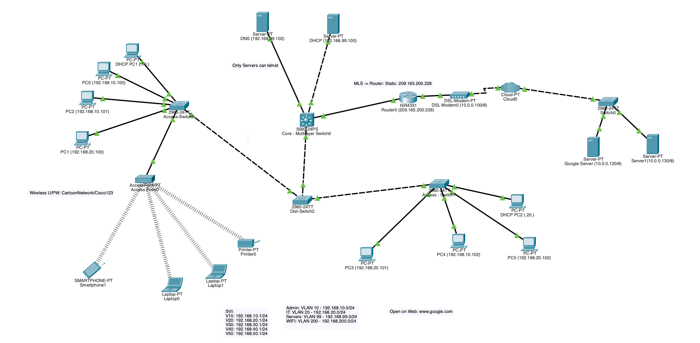

# Enterprise Network Design

## Overview

This project demonstrates the design and implementation of a small enterprise network using Cisco Packet Tracer. The network uses a hierarchical architecture with departmental VLAN segmentation, inter-VLAN routing, centralized network services, dynamic routing, Internet connectivity, and access-control policies.

## Network Topology

## VLAN Design

| VLAN | Name | Subnet |
|------|------|--------|
| 10 | Admin | 192.168.10.0/24 |
| 20 | IT | 192.168.20.0/24 |
| 30 | Finance | 192.168.30.0/24 |
| 40 | Sales | 192.168.40.0/24 |
| 50 | HR | 192.168.50.0/24 |
| 99 | Servers | 192.168.99.0/24 |
| 200 | Guest WiFi | 192.168.200.0/24 |

## Technologies Implemented

- VLAN segmentation
- 802.1Q trunking
- Inter-VLAN routing
- OSPF dynamic routing
- DHCP and DHCP relay
- DNS
- NAT/PAT
- Extended Access Control Lists (ACLs)
- Wireless networking
- IPv4 addressing and subnetting

## Security

Extended ACLs are used to restrict Guest WiFi access to internal enterprise networks while maintaining access to permitted network services and external resources.

## Testing and Validation

The network was tested for:

- DHCP address assignment
- Inter-VLAN connectivity
- DNS resolution
- External network connectivity
- OSPF routing
- NAT/PAT operation
- ACL enforcement

## Project File

The complete Cisco Packet Tracer topology is available in:

`PT - Enterprise Network Design.pkt`
Enterprise network designed in Cisco Packet Tracer featuring VLANs, inter-VLAN routing, OSPF, DHCP, DNS, NAT/PAT, ACLs, and wireless networking.
